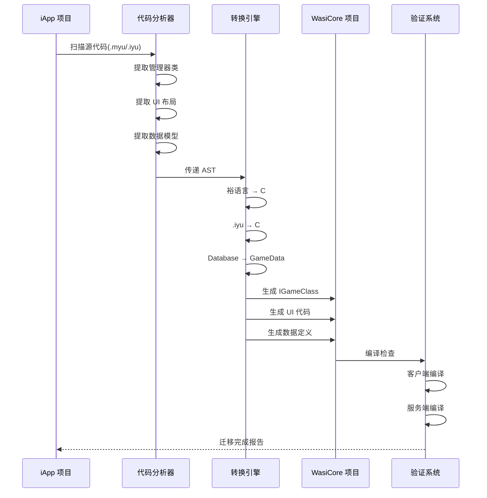

# 设计文档: iApp 到 WasiCore 迁移

## 概述

本文档描述了将"纪元修仙"游戏从 iApp 框架(裕语言 V5 + Java)迁移到 WasiCore 框架(C# / .NET 9.0)的完整技术方案。项目包含约 150 个文件(40+ 管理器类、60+ UI 界面),需要系统性地转换架构、语言、UI 系统和数据存储机制。

## 主要算法/工作流



## 核心接口/类型

### 管理器基类

```csharp
// WasiCore 管理器基类
public abstract class GameManager : IGameClass
{
    public static void OnRegisterGameClass()
    {
        Game.OnGameTriggerInitialization += OnGameTriggerInitialization;
    }
    
    private static void OnGameTriggerInitialization()
    {
        if (Game.GameModeLink != ScopeData.GameDataGameMode.MapGameMode) return;
        Initialize();
    }
    
    protected abstract void Initialize();
}
```

### UI 组件基类

```csharp
// WasiCore UI 组件基类（使用流式布局）
public class GameUIComponent
{
    protected Panel RootPanel { get; private set; }
    
    public virtual void Initialize()
    {
        RootPanel = new Panel()
            .FullScreen()
            .FlowVertical()           // 垂直流式布局
            .ContentAlignHorizontal(HorizontalContentAlignment.Center)
            .Background(Color.Transparent);
        
        BuildUI();
        RootPanel.AddToVisualTree();
    }
    
    protected abstract void BuildUI();
    
    public virtual void Show() => RootPanel.Visible = true;
    public virtual void Hide() => RootPanel.Visible = false;
}
```

### 数据模型基类

```csharp
// 玩家数据模型
public class PlayerData
{
    public string Name { get; set; }
    public int Level { get; set; }
    public string Realm { get; set; }
    public long Gold { get; set; }
    public int MaxHp { get; set; }
    public int CurrentHp { get; set; }
}
```


## 关键函数与形式化规范

### 函数 1: 管理器类转换

```csharp
// 转换 iApp 管理器类到 WasiCore IGameClass
public static class ManagerConverter
{
    // 前置条件:
    // - sourceFile 是有效的 .myu 文件路径
    // - 文件包含至少一个管理器类定义
    // 后置条件:
    // - 返回有效的 C# IGameClass 代码
    // - 所有裕语言语法已转换为 C# 语法
    // - 单例模式已转换为静态类
    public static string ConvertManager(string sourceFile)
    {
        // 实现略
    }
}
```

**前置条件:**
- `sourceFile` 指向有效的 .myu 文件
- 文件包含管理器类定义(sy 变量、ff 函数)
- 文件编码为 UTF-8

**后置条件:**
- 返回符合 WasiCore 规范的 C# 代码
- 所有 `sy` 变量转换为 C# 字段
- 所有 `ff` 函数转换为 C# 方法
- 单例模式转换为静态类或 IGameClass

**循环不变式:** N/A (无循环)


### 函数 2: UI 布局转换

```csharp
// 转换 iApp .iyu 布局到 WasiCore 流式布局代码
public static class UIConverter
{
    // 前置条件:
    // - layoutFile 是有效的 .iyu 文件路径
    // - 文件包含 XML 格式的 Android 布局
    // 后置条件:
    // - 返回 WasiCore 流式布局代码
    // - 所有 Android 控件已映射到 WasiCore 控件
    // - 使用链式 API 和 FlowOrientation
    // - 适配竖屏布局（16:9 和 20:9）
    public static string ConvertLayout(string layoutFile)
    {
        // 实现略
    }
}
```

**前置条件:**
- `layoutFile` 指向有效的 .iyu 文件
- 文件包含 XML 格式的 Android 布局定义
- 布局包含可识别的 Android 控件

**后置条件:**
- 返回 WasiCore 流式布局代码
- LinearLayout → Panel + FlowOrientation.Vertical/Horizontal
- TextView → TextBlock
- Button → Button
- 使用链式 API（`.Size()`, `.Margin()`, `.AlignLeft()` 等）
- 所有子控件设置 `Parent = parentPanel`
- 适配竖屏比例（16:9 = 1080x1920, 20:9 = 1080x2400）
- 所有事件处理器已转换

**循环不变式:** 
- 遍历 XML 节点时，已处理的节点都已正确转换为 WasiCore 控件


### 函数 3: 数据存储转换

```csharp
// 转换 iApp Database 调用到 WasiCore CloudData
public static class DataConverter
{
    // 前置条件:
    // - code 包含 Database.保存数据() 或 Database.读取数据() 调用
    // 后置条件:
    // - Database 调用已转换为 CloudData API
    // - 服务端代码使用 User.UserId
    // - 客户端代码移除云数据访问
    public static string ConvertDataAccess(string code, bool isServerSide)
    {
        // 实现略
    }
}
```

**前置条件:**
- `code` 包含有效的裕语言代码
- `isServerSide` 正确标识代码运行环境

**后置条件:**
- `Database.保存数据(分类, 键, 值)` → `CloudData.Set(User.UserId, key, value)` (服务端)
- `Database.读取数据(分类, 键)` → `CloudData.Get(User.UserId, key)` (服务端)
- 客户端代码中的云数据访问已移除或标记为错误

**循环不变式:** N/A


## 算法伪代码

### 主迁移算法

```pascal
ALGORITHM MigrateIAppToWasiCore(projectPath)
INPUT: projectPath - iApp 项目根目录路径
OUTPUT: result - 迁移结果报告

BEGIN
  ASSERT DirectoryExists(projectPath + "/src")
  
  // 步骤 1: 扫描源文件
  managers ← ScanFiles(projectPath + "/src", "*.myu")
  layouts ← ScanFiles(projectPath + "/src", "*.iyu")
  
  ASSERT managers.Count > 0 OR layouts.Count > 0
  
  // 步骤 2: 分析依赖关系
  dependencyGraph ← BuildDependencyGraph(managers)
  sortedManagers ← TopologicalSort(dependencyGraph)
  
  // 步骤 3: 转换管理器类
  FOR EACH manager IN sortedManagers DO
    ASSERT IsValidManagerFile(manager)
    
    csharpCode ← ConvertManager(manager)
    outputPath ← "src/" + GetManagerName(manager) + ".cs"
    WriteFile(outputPath, csharpCode)
  END FOR
  
  // 步骤 4: 转换 UI 布局
  FOR EACH layout IN layouts DO
    ASSERT IsValidLayoutFile(layout)
    
    uiCode ← ConvertLayout(layout)
    outputPath ← "src/UI/" + GetLayoutName(layout) + ".cs"
    WriteFile(outputPath, uiCode)
  END FOR
  
  // 步骤 5: 生成数据定义
  dataModels ← ExtractDataModels(managers)
  FOR EACH model IN dataModels DO
    jsonSchema ← GenerateJsonSchema(model)
    WriteFile("editor/data/" + model.Name + ".json", jsonSchema)
  END FOR
  
  // 步骤 6: 验证编译
  clientResult ← CompileProject("Client-Debug")
  serverResult ← CompileProject("Server-Debug")
  
  ASSERT clientResult.Success AND serverResult.Success
  
  RETURN CreateMigrationReport(managers, layouts, dataModels)
END
```

**前置条件:**
- `projectPath` 指向有效的 iApp 项目目录
- 项目包含 src/ 目录
- 至少存在一个 .myu 或 .iyu 文件

**后置条件:**
- 所有管理器类已转换为 C# IGameClass
- 所有 UI 布局已转换为 WasiCore Canvas 代码
- 数据模型已生成 JSON Schema
- 客户端和服务端编译成功

**循环不变式:**
- 转换管理器循环: 所有已处理的管理器都已成功转换并写入文件
- 转换布局循环: 所有已处理的布局都已成功转换并写入文件


### 语法转换算法

```pascal
ALGORITHM ConvertYuLanguageToCSharp(sourceCode)
INPUT: sourceCode - 裕语言源代码字符串
OUTPUT: csharpCode - C# 代码字符串

BEGIN
  tokens ← Tokenize(sourceCode)
  ast ← ParseToAST(tokens)
  
  // 转换变量声明
  FOR EACH node IN ast WHERE node.Type = "VariableDeclaration" DO
    IF node.Modifier = "sy" THEN
      node.CSharpModifier ← "private static"
    ELSE IF node.Modifier = "s" THEN
      node.CSharpModifier ← "var"
    END IF
  END FOR
  
  // 转换函数声明
  FOR EACH node IN ast WHERE node.Type = "FunctionDeclaration" DO
    IF node.Modifier = "qj ff" THEN
      node.CSharpModifier ← "public static"
    ELSE IF node.Modifier = "ff" THEN
      node.CSharpModifier ← "public"
    END IF
    
    // 转换返回语句
    ReplaceKeyword(node.Body, "fh", "return")
  END FOR
  
  // 转换控制流
  ReplaceKeyword(ast, "rg", "if")
  ReplaceKeyword(ast, "fou", "false")
  ReplaceKeyword(ast, "shi", "true")
  ReplaceKeyword(ast, "xh", "for")
  
  // 转换 Java 代码块
  FOR EACH node IN ast WHERE node.Type = "JavaBlock" DO
    // Java 代码块保持不变，但需要检查 API 兼容性
    ValidateJavaAPIs(node.Content)
  END FOR
  
  csharpCode ← GenerateCode(ast)
  RETURN csharpCode
END
```

**前置条件:**
- `sourceCode` 是有效的裕语言代码
- 代码符合裕语言 V5 语法规范

**后置条件:**
- 返回有效的 C# 代码
- 所有裕语言关键字已转换
- 变量和函数声明符合 C# 规范

**循环不变式:**
- 变量声明循环: 所有已处理的变量声明都有有效的 C# 修饰符
- 函数声明循环: 所有已处理的函数都有有效的 C# 签名


## 示例用法

### 示例 1: 管理器类迁移

**iApp 源代码 (BattleManager.myu):**

```java
// 裕语言代码
sy Database db
sy int 当前回合 = 0
sy boolean 战斗进行中 = false

qj ff BattleManager getInstance() {
    java {
        return getInstances();
    }
}

ff boolean 开始战斗(string 敌人配置JSON) {
    当前回合 = 0
    战斗进行中 = true
    
    rg 初始化战斗(敌人配置JSON) {
        fh shi
    }
    fh fou
}
```

**WasiCore 目标代码 (BattleManager.cs):**

```csharp
// C# 代码
public class BattleManager : IGameClass
{
    private static int currentRound = 0;
    private static bool battleInProgress = false;
    
    public static void OnRegisterGameClass()
    {
        Game.OnGameTriggerInitialization += OnGameTriggerInitialization;
    }
    
    private static void OnGameTriggerInitialization()
    {
        if (Game.GameModeLink != ScopeData.GameDataGameMode.MapGameMode) return;
        Initialize();
    }
    
    private static void Initialize()
    {
        // 初始化逻辑
    }
    
    #if SERVER
    public static bool StartBattle(string enemyConfigJson)
    {
        currentRound = 0;
        battleInProgress = true;
        
        if (InitializeBattle(enemyConfigJson))
        {
            return true;
        }
        return false;
    }
    #endif
}
```


### 示例 2: UI 布局迁移（流式布局）

**iApp 源代码 (ui_battle.iyu):**

```xml
<!-- Android XML 布局 -->
<LinearLayout
    android:layout_width="match_parent"
    android:layout_height="match_parent"
    android:orientation="vertical">
    
    <TextView
        android:id="@+id/tv_round"
        android:layout_width="wrap_content"
        android:layout_height="wrap_content"
        android:text="回合: 1"
        android:textSize="18sp"/>
    
    <Button
        android:id="@+id/btn_attack"
        android:layout_width="match_parent"
        android:layout_height="wrap_content"
        android:text="攻击"/>
</LinearLayout>
```

**WasiCore 目标代码 (BattleUI.cs) - 使用流式布局:**

```csharp
// C# UI 代码 - 流式布局（适配竖屏 16:9 和 20:9）
#if CLIENT
public class BattleUI : IGameClass
{
    private static Panel rootPanel;
    private static TextBlock roundText;
    private static Button attackButton;
    
    // 设计分辨率（竖屏 16:9）
    private const float DesignWidth = 1080f;
    private const float DesignHeight = 1920f;
    
    public static void OnRegisterGameClass()
    {
        Game.OnGameStart += OnGameStart;
    }
    
    private static void OnGameStart()
    {
        InitializeUI();
    }
    
    private static void InitializeUI()
    {
        // 根容器 - 使用流式布局
        rootPanel = new Panel()
            .FullScreen()
            .FlowVertical()                    // 垂直流式布局
            .Padding(20)                       // 统一内边距
            .Background(Color.Transparent);
        
        // 回合文本
        roundText = new TextBlock()
            .Text("回合: 1")
            .FontSize(18)
            .TextColor(Color.White)
            .Margin(0, 0, 0, 10);              // 底部间距
        roundText.Parent = rootPanel;          // 自动加入流式布局
        
        // 攻击按钮
        attackButton = new Button()
            .Text("攻击")
            .Size(DesignWidth - 40, 50)        // 适配屏幕宽度
            .FontSize(16)
            .OnClick(OnAttackClicked);
        attackButton.Parent = rootPanel;
        
        rootPanel.AddToVisualTree();
    }
    
    private static void OnAttackClicked()
    {
        // 处理攻击逻辑
        #if SERVER
        // 发送攻击请求到服务端
        #endif
    }
}
#endif
```

**关键改进：**
- ✅ 使用 `Panel` 代替 `Canvas`（流式布局）
- ✅ 使用 `.FlowVertical()` 自动垂直堆叠
- ✅ 使用链式 API（`.Text()`, `.FontSize()`, `.Margin()` 等）
- ✅ 定义设计分辨率常量（1080x1920，16:9 竖屏）
- ✅ 子控件通过 `Parent = rootPanel` 自动加入布局
- ✅ 避免手动设置对齐（流式布局自动处理）


### 示例 2.1: 完整竖屏界面（背包系统）

**WasiCore 代码 - 竖屏背包界面（16:9 和 20:9 适配）:**

```csharp
#if CLIENT
public class BagUI : IGameClass
{
    // 设计分辨率（竖屏 16:9）
    private const float DesignWidth = 1080f;
    private const float DesignHeight = 1920f;
    
    private static Panel rootPanel;
    private static Panel headerPanel;
    private static ScrollViewer scrollViewer;
    private static Panel gridPanel;
    private static Panel footerPanel;
    
    public static void OnRegisterGameClass()
    {
        Game.OnGameStart += OnGameStart;
    }
    
    private static void OnGameStart()
    {
        InitializeUI();
    }
    
    private static void InitializeUI()
    {
        // 根容器 - 全屏流式布局
        rootPanel = new Panel()
            .FullScreen()
            .FlowVertical()
            .Background(new Color(20, 20, 30, 255));
        
        // 顶部标题栏（固定高度）
        headerPanel = new Panel()
            .Size(DesignWidth, 100)
            .FlowHorizontal()
            .ContentAlignVertical(VerticalContentAlignment.Center)
            .Padding(20, 0)
            .Background(new Color(30, 30, 40, 255));
        headerPanel.Parent = rootPanel;
        
        var titleText = new TextBlock()
            .Text("背包")
            .FontSize(24)
            .TextColor(Color.White)
            .Bold();
        titleText.Parent = headerPanel;
        
        var closeButton = new Button()
            .Text("关闭")
            .Size(80, 40)
            .FontSize(16)
            .Margin(0, 0, 0, 0)
            .OnClick(OnCloseClicked);
        closeButton.Parent = headerPanel;
        
        // 中间滚动区域（自动填充剩余空间）
        scrollViewer = new ScrollViewer()
            .HeightGrow(1)                     // 填充剩余高度
            .WidthGrow(1)
            .VerticalScrollBarVisibility(ScrollBarVisibility.Auto);
        scrollViewer.Parent = rootPanel;
        
        // 物品网格（4 列，适配竖屏）
        gridPanel = new Panel()
            .AutoHeight()
            .WidthGrow(1)
            .FlowVertical()
            .Padding(10);
        scrollViewer.Content = gridPanel;
        
        // 创建物品网格（4 列 x N 行）
        CreateItemGrid(4, 20);  // 4 列，20 个物品
        
        // 底部按钮栏（固定高度）
        footerPanel = new Panel()
            .Size(DesignWidth, 80)
            .FlowHorizontal()
            .JustifySpaceAround()              // 按钮均匀分布
            .ContentAlignVertical(VerticalContentAlignment.Center)
            .Padding(20, 0)
            .Background(new Color(30, 30, 40, 255));
        footerPanel.Parent = rootPanel;
        
        var sortButton = new Button()
            .Text("整理")
            .Size(150, 50)
            .FontSize(16)
            .OnClick(OnSortClicked);
        sortButton.Parent = footerPanel;
        
        var sellButton = new Button()
            .Text("出售")
            .Size(150, 50)
            .FontSize(16)
            .OnClick(OnSellClicked);
        sellButton.Parent = footerPanel;
        
        rootPanel.AddToVisualTree();
    }
    
    private static void CreateItemGrid(int columns, int itemCount)
    {
        int rows = (itemCount + columns - 1) / columns;
        float itemSize = (DesignWidth - 40) / columns - 10;  // 计算物品格子大小
        
        for (int row = 0; row < rows; row++)
        {
            var rowPanel = new Panel()
                .Size(DesignWidth - 20, itemSize + 10)
                .FlowHorizontal()
                .JustifySpaceAround()
                .Margin(0, 5);
            rowPanel.Parent = gridPanel;
            
            for (int col = 0; col < columns; col++)
            {
                int index = row * columns + col;
                if (index >= itemCount) break;
                
                var itemSlot = CreateItemSlot(index, itemSize);
                itemSlot.Parent = rowPanel;
            }
        }
    }
    
    private static Panel CreateItemSlot(int index, float size)
    {
        var slot = new Panel()
            .Size(size, size)
            .Background(new Color(40, 40, 50, 255))
            .CornerRadius(8);
        
        // 物品图标（占位）
        var icon = new Image()
            .Size(size - 20, size - 20)
            .Margin(10);
        icon.Parent = slot;
        
        // 物品数量
        var countText = new TextBlock()
            .Text($"{index + 1}")
            .FontSize(12)
            .TextColor(Color.White)
            .AlignRight()
            .AlignBottom()
            .Margin(0, 0, 5, 5);
        countText.Parent = slot;
        
        return slot;
    }
    
    private static void OnCloseClicked()
    {
        rootPanel.Visible = false;
    }
    
    private static void OnSortClicked()
    {
        Game.Logger.LogInformation("整理背包");
    }
    
    private static void OnSellClicked()
    {
        Game.Logger.LogInformation("出售物品");
    }
}
#endif
```

**布局结构：**
```
rootPanel (全屏, FlowVertical)
├── headerPanel (固定高度 100, FlowHorizontal)
│   ├── titleText ("背包")
│   └── closeButton ("关闭")
├── scrollViewer (HeightGrow=1, 填充剩余空间)
│   └── gridPanel (FlowVertical)
│       ├── rowPanel (FlowHorizontal, 4 列)
│       ├── rowPanel (FlowHorizontal, 4 列)
│       └── ...
└── footerPanel (固定高度 80, FlowHorizontal)
    ├── sortButton ("整理")
    └── sellButton ("出售")
```

**关键技术：**
- ✅ 使用 `.HeightGrow(1)` 让中间区域填充剩余空间
- ✅ 使用 `ScrollViewer` 实现滚动
- ✅ 使用 `.JustifySpaceAround()` 均匀分布按钮
- ✅ 动态计算物品格子大小适配屏幕宽度
- ✅ 使用 `.CornerRadius()` 实现圆角
- ✅ 完全使用流式布局，无需手动计算坐标


### 示例 3: 数据存储迁移

**iApp 源代码:**

```java
// 裕语言 - Database 调用
ff 保存玩家数据() {
    db.保存数据("基础属性", "等级", 99)
    db.保存数据("基础属性", "金币", 888888L)
    db.保存数据("基础属性", "名字", "测试剑仙")
}

ff int 获取玩家等级() {
    Object 等级 = db.读取数据("基础属性", "等级")
    rg 等级 != null {
        java {
            return ((Number)等级).intValue();
        }
    }
    fh 1
}
```

**WasiCore 目标代码:**

```csharp
// C# - CloudData API (服务端)
#if SERVER
public static async Task SavePlayerData(long userId)
{
    await CloudData.Set(userId, "player_level", 99);
    await CloudData.Set(userId, "player_gold", 888888L);
    await CloudData.Set(userId, "player_name", "测试剑仙");
}

public static async Task<int> GetPlayerLevel(long userId)
{
    var level = await CloudData.Get<int>(userId, "player_level");
    return level ?? 1;
}
#endif
```

**或使用 GameData (静态配置):**

```csharp
// editor/data/PlayerConfig.json
{
  "$type": "GameDataPlayerSettings",
  "Name": "PlayerConfig",
  "StartLevel": 1,
  "StartGold": 10000
}
```


## 正确性属性

*属性是一个特征或行为，应该在系统的所有有效执行中保持为真——本质上是关于系统应该做什么的形式化陈述。属性作为人类可读规范和机器可验证正确性保证之间的桥梁。*

### 属性 1: 文件扫描完整性

*对于任何* iApp 项目目录，扫描操作应该发现所有 .myu 和 .iyu 文件，并且生成的清单应该包含每个文件的路径、类型和大小信息

**验证需求: 1.1, 1.2**

### 属性 2: 裕语言关键字转换一致性

*对于任何* 包含裕语言关键字的源代码，转换引擎应该将所有关键字实例转换为对应的 C# 关键字（sy→private static, s→var, ff→public, qj ff→public static, rg→if, xh→for, fh→return, shi→true, fou→false）

**验证需求: 2.1, 2.2, 2.3, 2.4, 2.5, 2.6, 2.7, 2.8, 2.9**

### 属性 3: IGameClass 结构完整性

*对于任何* 转换后的管理器类，该类应该实现 IGameClass 接口，包含 OnRegisterGameClass() 静态方法，在该方法中订阅 Game.OnGameTriggerInitialization 事件，并在回调中检查 Game.GameModeLink

**验证需求: 3.1, 3.2, 3.3, 3.4**

### 属性 4: Android 控件映射正确性

*对于任何* Android UI 控件（LinearLayout, TextView, Button, EditText, ImageView），转换引擎应该生成对应的 WasiCore 控件（Canvas+FlowOrientation, TextBlock, Button, TextBox, Image），并保留所有相关属性

**验证需求: 4.1, 4.4, 4.5, 4.6, 4.7**

### 属性 5: UI 父子关系保持

*对于任何* UI 布局中的父子控件关系，转换后的代码应该使用 child.Parent = parent 模式建立相同的层次结构

**验证需求: 4.8**

### 属性 6: Database API 映射正确性

*对于任何* Database API 调用（保存数据、读取数据、删除数据），转换引擎应该生成对应的 CloudData API 调用（Set, Get, Delete），并使用 User.UserId 作为用户标识符

**验证需求: 5.1, 5.2, 5.3, 5.5**

### 属性 7: 条件编译正确性

*对于任何* 生成的代码，游戏逻辑和云数据访问应该包裹在 #if SERVER 块中，UI 渲染代码应该包裹在 #if CLIENT 块中

**验证需求: 3.6, 4.10, 5.4, 11.1, 11.2, 11.3, 11.4**

### 属性 8: 依赖顺序正确性

*对于任何* 具有依赖关系的管理器集合，转换引擎应该按照拓扑排序的顺序处理文件，确保被依赖的类先于依赖它的类被转换

**验证需求: 7.2, 7.4**

### 属性 9: 循环依赖检测

*对于任何* 包含循环依赖的管理器集合，转换引擎应该检测到循环并生成警告报告

**验证需求: 7.3**

### 属性 10: GameData JSON 结构正确性

*对于任何* 生成的 GameData JSON 文件，该文件应该包含 $type 字段，位于 editor/data/ 目录中，并且对象引用使用 $ObjectName 格式

**验证需求: 6.3, 6.4, 6.5**

### 属性 11: WebAssembly 兼容性转换

*对于任何* 包含 Task.Run()、Task.Delay()、Thread API 或 Console.WriteLine() 的代码，转换引擎应该将其转换为 WebAssembly 兼容的等价物（直接 await、Game.Delay()、移除线程、Game.Logger.LogInformation()）

**验证需求: 12.1, 12.2, 12.3, 12.5**

### 属性 12: 日志参数化格式

*对于任何* 日志调用，转换引擎应该使用参数化模板格式（Game.Logger.LogInformation(template, args)）而不是字符串插值

**验证需求: 13.1**

### 属性 13: C# 命名规范一致性

*对于任何* 生成的 C# 代码，公共成员应该使用 PascalCase，私有字段应该使用 camelCase，异步方法应该有 Async 后缀，接口应该有 I 前缀

**验证需求: 17.1, 17.2, 17.5, 17.6**

### 属性 14: 代码格式一致性

*对于任何* 生成的 C# 代码，应该使用 4 空格缩进和 Allman 大括号风格

**验证需求: 17.3, 17.4**

### 属性 15: 安全特性移除完整性

*对于任何* 包含移动端安全特性（Root 检测、模拟器检测、Hook 检测、SSL 认证）的代码，转换引擎应该移除该代码并添加说明注释

**验证需求: 10.1, 10.2, 10.3, 10.4**

### 属性 16: 错误处理完整性

*对于任何* 不支持的裕语言特性或不兼容的 Android API，转换引擎应该生成警告或错误，并在代码中添加 TODO 注释或在报告中标记需要手动处理

**验证需求: 9.1, 9.2, 9.3**

### 属性 17: 迁移报告完整性

*对于任何* 完成的迁移，转换引擎应该生成包含统计信息（管理器数量、UI 数量、数据模型数量、编译结果）、警告列表和下一步建议的报告

**验证需求: 9.4, 15.2, 15.3, 15.4, 15.5, 15.7**

### 属性 18: 增量迁移文件选择性

*对于任何* 指定的文件子集，转换引擎应该仅转换该子集，保留其他文件不变，并在报告中区分新转换和已存在的文件

**验证需求: 16.1, 16.2, 16.4**

### 属性 19: 文档注释完整性

*对于任何* 生成的类和公共方法，转换引擎应该添加 XML 文档注释，对于需要手动处理的代码应该添加 TODO 注释

**验证需求: 19.1, 19.2, 19.4**

### 属性 20: 配置选项有效性

*对于任何* 配置选项（输出目录、转换规则、API 映射、日志级别），转换引擎应该正确应用该配置并影响转换行为

**验证需求: 20.2, 20.3, 20.4, 20.5**

### 属性 21: 编译成功性

*对于任何* 迁移后的项目，客户端配置（Client-Debug）和服务端配置（Server-Debug）都应该编译成功，无编译错误

**验证需求: 8.5, 8.6**


## 错误处理

### 错误场景 1: 不支持的裕语言特性

**条件:** 源代码包含无法直接转换的裕语言特性

**响应:** 
- 记录警告日志
- 生成带 TODO 注释的 C# 代码
- 在迁移报告中标记需要手动处理

**恢复:** 
- 提供手动转换指南
- 建议替代实现方案

### 错误场景 2: Android API 不兼容

**条件:** UI 代码使用 WasiCore 不支持的 Android API

**响应:**
- 查找 API 映射表
- 如果存在映射，自动转换
- 如果不存在，生成错误报告

**恢复:**
- 使用 WasiCore 等价 API
- 或移除不必要的功能

### 错误场景 3: 数据库结构不兼容

**条件:** iApp Database 使用的分类结构无法直接映射到 CloudData

**响应:**
- 分析数据访问模式
- 生成数据迁移脚本
- 创建 JSON Schema 定义

**恢复:**
- 重新设计数据结构
- 使用 GameData 替代 CloudData (静态配置)

### 错误场景 4: 编译失败

**条件:** 生成的 C# 代码无法编译

**响应:**
- 收集编译错误信息
- 定位错误源文件
- 回滚到上一个可编译状态

**恢复:**
- 修复语法错误
- 调整 API 调用
- 重新运行转换


## 测试策略

### 单元测试方法

**测试目标:**
- 验证语法转换的正确性
- 验证 API 映射的准确性
- 验证数据结构转换的完整性

**关键测试用例:**

1. **裕语言到 C# 语法转换**
   - 测试变量声明转换 (sy → private static, s → var)
   - 测试函数声明转换 (ff → public, qj ff → public static)
   - 测试控制流转换 (rg → if, xh → for, fh → return)
   - 测试布尔值转换 (shi → true, fou → false)

2. **管理器类转换**
   - 测试单例模式转换为 IGameClass
   - 测试依赖注入转换
   - 测试事件注册转换

3. **UI 布局转换**
   - 测试 LinearLayout → FlowOrientation 转换
   - 测试 TextView → TextBlock 转换
   - 测试 Button → Button 转换(保持对齐)
   - 测试事件处理器转换

### 属性测试方法

**属性测试库:** 使用 C# 的 FsCheck 或 Hedgehog

**测试属性:**

1. **语法转换可逆性**
   ```csharp
   // 属性: 转换后的代码应该能够表达原始语义
   Property: ∀ code ∈ ValidYuLanguageCode,
             Semantics(code) ≈ Semantics(ConvertToCSharp(code))
   ```

2. **UI 层次结构保持**
   ```csharp
   // 属性: UI 父子关系应该保持不变
   Property: ∀ layout ∈ UILayouts,
             GetHierarchy(layout) = GetHierarchy(ConvertLayout(layout))
   ```

3. **数据访问等价性**
   ```csharp
   // 属性: 数据读写操作应该产生相同结果
   Property: ∀ key, value,
             iApp.Database.保存数据(key, value) ≈ 
             WasiCore.CloudData.Set(userId, key, value)
   ```

### 集成测试方法

**测试场景:**

1. **完整管理器迁移测试**
   - 迁移 BattleManager
   - 验证战斗逻辑正确性
   - 验证客户端/服务端分离

2. **完整 UI 迁移测试**
   - 迁移主界面 (game_main.iyu)
   - 验证布局渲染正确
   - 验证事件响应正常

3. **端到端测试**
   - 迁移完整游戏流程
   - 从登录到战斗到存档
   - 验证所有功能正常


## 性能考虑

### 关键性能指标

1. **转换速度**
   - 目标: 每个管理器类转换时间 < 5 秒
   - 目标: 每个 UI 布局转换时间 < 3 秒
   - 目标: 完整项目(150 文件)转换时间 < 10 分钟

2. **运行时性能**
   - WasiCore 使用 WebAssembly，性能接近原生
   - 避免频繁的跨边界调用(C# ↔ JavaScript)
   - 使用条件编译减少不必要的代码

3. **内存使用**
   - iApp: 基于 Android 运行时，内存管理由 JVM 处理
   - WasiCore: 基于 .NET 9.0，内存管理由 GC 处理
   - 注意: WebAssembly 环境内存限制

### 性能优化策略

1. **批量转换**
   - 并行处理独立的管理器类
   - 使用依赖图优化转换顺序
   - 缓存中间结果

2. **代码生成优化**
   - 避免生成冗余代码
   - 使用静态类代替单例模式
   - 内联简单函数

3. **运行时优化**
   - 使用 `#if CLIENT` / `#if SERVER` 减少代码体积
   - 避免装箱/拆箱操作
   - 使用值类型代替引用类型(适当情况下)

### WebAssembly 特定约束

**禁止的操作:**
- ❌ `Task.Run()` - 无线程池，直接 await
- ❌ `Task.Delay()` - 使用 `Game.Delay()`
- ❌ `Thread` 或任何线程 API
- ❌ 多维数组 `[,]` 用于 JSON 序列化

**推荐的操作:**
- ✅ 直接调用 async 方法
- ✅ 使用 `Game.Delay()` 代替 `Task.Delay()`
- ✅ 使用一维数组
- ✅ 使用 `Game.Logger.LogInformation()` 参数化模板


## 安全考虑

### iApp 安全特性(不需要迁移)

以下 iApp 安全特性是移动端特有的，WasiCore 不需要:

1. **Root 检测** - 移动端特有
2. **模拟器检测** - 移动端特有
3. **Hook 框架检测** - 移动端特有
4. **SSL 双向认证** - WasiCore 有自己的网络层

### WasiCore 安全策略

1. **客户端/服务端分离**
   - 所有游戏逻辑在服务端执行
   - 客户端只负责渲染和输入
   - 使用 `#if SERVER` 保护敏感代码

2. **数据验证**
   - 服务端验证所有客户端输入
   - 使用 JSON Schema 验证数据格式
   - 防止注入攻击

3. **云数据安全**
   - CloudData 只能在服务端访问
   - 使用 `User.UserId` (long) 标识用户
   - 不要使用 `Player.Id` (int, 临时)

4. **代码混淆**
   - WasiCore 编译为 WebAssembly
   - 代码自动混淆
   - 难以逆向工程

### 迁移安全检查清单

- [ ] 移除所有移动端特有的安全检测代码
- [ ] 确保游戏逻辑在 `#if SERVER` 块中
- [ ] 验证所有 CloudData 访问使用 `User.UserId`
- [ ] 移除客户端的云数据访问代码
- [ ] 添加服务端输入验证
- [ ] 使用 JSON Schema 验证数据


## 构建与验证

### 构建命令（完整路径）

**dotnet SDK 完整路径:**
```
D:\360downloads\星火编辑器\Update\editor-alpha.spark.xd.com\Res\_m\wasm\dotnet_sdk_lite\2\dotnet_sdk_lite\dotnet.exe
```

**客户端构建:**
```powershell
& "D:\360downloads\星火编辑器\Update\editor-alpha.spark.xd.com\Res\_m\wasm\dotnet_sdk_lite\2\dotnet_sdk_lite\dotnet.exe" build src/GameEntry.csproj -c Client-Debug
```

**服务端构建:**
```powershell
& "D:\360downloads\星火编辑器\Update\editor-alpha.spark.xd.com\Res\_m\wasm\dotnet_sdk_lite\2\dotnet_sdk_lite\dotnet.exe" build src/GameEntry.csproj -c Server-Debug
```

**带输出过滤的构建命令:**
```powershell
# 构建服务端并显示结果
$output = & "D:\360downloads\星火编辑器\Update\editor-alpha.spark.xd.com\Res\_m\wasm\dotnet_sdk_lite\2\dotnet_sdk_lite\dotnet.exe" build src/GameEntry.csproj -c Server-Debug 2>&1
$output | Select-String -Pattern "成功|失败" | Select-Object -Last 1

# 构建客户端并显示结果
$output = & "D:\360downloads\星火编辑器\Update\editor-alpha.spark.xd.com\Res\_m\wasm\dotnet_sdk_lite\2\dotnet_sdk_lite\dotnet.exe" build src/GameEntry.csproj -c Client-Debug 2>&1
$output | Select-String -Pattern "成功|失败" | Select-Object -Last 1
```

**注意事项:**
- 必须使用完整路径，不能使用简化的 `dotnet` 命令
- 测试版（alpha）才支持 C# 开发
- dotnet SDK 位于版本 2 目录
- 两个配置都必须编译成功

### 验证流程

**编译验证伪代码:**
```pascal
FUNCTION CompileProject(configuration: string): CompileResult
BEGIN
  dotnetPath ← "D:\360downloads\星火编辑器\Update\editor-alpha.spark.xd.com\Res\_m\wasm\dotnet_sdk_lite\2\dotnet_sdk_lite\dotnet.exe"
  projectPath ← "src/GameEntry.csproj"
  
  command ← dotnetPath + " build " + projectPath + " -c " + configuration
  result ← ExecuteCommand(command)
  
  IF result.ExitCode = 0 THEN
    RETURN CompileResult(Success: true, Errors: [])
  ELSE
    errors ← ParseCompileErrors(result.Output)
    RETURN CompileResult(Success: false, Errors: errors)
  END IF
END
```

**完整验证流程:**
1. 转换源代码（管理器类、UI、数据）
2. 生成 C# 文件到 src/ 目录
3. 编译客户端配置（Client-Debug）
4. 编译服务端配置（Server-Debug）
5. 验证无编译错误
6. 运行单元测试
7. 生成迁移报告

## 竖屏布局适配策略

### 设计分辨率

**推荐设计分辨率：**
- **16:9 竖屏**: 1080 x 1920（主流手机）
- **20:9 竖屏**: 1080 x 2400（全面屏手机）

```csharp
// 定义设计分辨率常量
public static class DesignResolution
{
    // 16:9 竖屏
    public const float Width_16_9 = 1080f;
    public const float Height_16_9 = 1920f;
    
    // 20:9 竖屏
    public const float Width_20_9 = 1080f;
    public const float Height_20_9 = 2400f;
    
    // 当前使用的分辨率
    public static float Width => Width_16_9;
    public static float Height => Height_16_9;
}
```

### 布局模式

**1. 顶部-中间-底部布局（最常用）**

```csharp
var rootPanel = new Panel()
    .FullScreen()
    .FlowVertical();

// 顶部固定区域（标题栏、状态栏）
var header = new Panel()
    .Size(DesignResolution.Width, 100)
    .FlowHorizontal();
header.Parent = rootPanel;

// 中间可滚动区域（自动填充剩余空间）
var scrollViewer = new ScrollViewer()
    .HeightGrow(1)
    .WidthGrow(1);
scrollViewer.Parent = rootPanel;

// 底部固定区域（按钮栏、导航栏）
var footer = new Panel()
    .Size(DesignResolution.Width, 80)
    .FlowHorizontal();
footer.Parent = rootPanel;
```

**2. 网格布局（背包、商店）**

```csharp
// 4 列网格（适配竖屏）
int columns = 4;
float itemSize = (DesignResolution.Width - padding * 2) / columns - spacing;

var gridPanel = new Panel()
    .FlowVertical()
    .Padding(padding);

for (int row = 0; row < rows; row++)
{
    var rowPanel = new Panel()
        .FlowHorizontal()
        .JustifySpaceAround();
    rowPanel.Parent = gridPanel;
    
    for (int col = 0; col < columns; col++)
    {
        var item = CreateItem(itemSize);
        item.Parent = rowPanel;
    }
}
```

**3. 列表布局（聊天、任务）**

```csharp
var scrollViewer = new ScrollViewer()
    .FullScreen()
    .VerticalScrollBarVisibility(ScrollBarVisibility.Auto);

var listPanel = new Panel()
    .FlowVertical()
    .AutoHeight()
    .Padding(10);
scrollViewer.Content = listPanel;

// 动态添加列表项
for (int i = 0; i < itemCount; i++)
{
    var listItem = CreateListItem(i);
    listItem.Parent = listPanel;
}
```

**4. 标签页布局（多页面切换）**

```csharp
var rootPanel = new Panel()
    .FullScreen()
    .FlowVertical();

// 顶部标签栏
var tabBar = new Panel()
    .Size(DesignResolution.Width, 60)
    .FlowHorizontal()
    .JustifySpaceAround();
tabBar.Parent = rootPanel;

// 内容区域
var contentPanel = new Panel()
    .HeightGrow(1)
    .WidthGrow(1);
contentPanel.Parent = rootPanel;
```

### 响应式适配

**使用响应式 API 适配不同屏幕：**

```csharp
// 响应式宽度（最小 1080，最大 1440）
var panel = new Panel()
    .ResponsiveWidth(1080, 1440)
    .ResponsiveHeight(1920, 2400);

// 响应式字体大小
var label = new TextBlock()
    .ResponsiveFontSize(14, 20, 1.2f);

// 响应式间距
var container = new Panel()
    .ResponsiveSpacing(10, 20)
    .ResponsivePadding(15, 30);

// 响应式方向（横屏时切换为水平布局）
var panel = new Panel()
    .ResponsiveOrientation(
        Orientation.Vertical,   // 竖屏
        Orientation.Horizontal  // 横屏
    );
```

### 安全区域处理

**保持内容在安全区域内：**

```csharp
// 顶部安全区域（刘海屏、状态栏）
var topSafeArea = 50f;

// 底部安全区域（手势条、虚拟按键）
var bottomSafeArea = 30f;

var rootPanel = new Panel()
    .FullScreen()
    .Padding(0, topSafeArea, 0, bottomSafeArea);
```

### 常见布局尺寸

| 元素 | 推荐高度 | 说明 |
|------|---------|------|
| 标题栏 | 80-100px | 包含标题和关闭按钮 |
| 按钮 | 50-60px | 标准按钮高度 |
| 列表项 | 60-80px | 单行列表项 |
| 输入框 | 50px | 文本输入框 |
| 导航栏 | 60-80px | 底部导航栏 |
| 物品格子 | (屏宽-边距)/4 | 4 列网格 |

### 布局检查清单

- [ ] 使用 `.FlowVertical()` 或 `.FlowHorizontal()` 流式布局
- [ ] 定义设计分辨率常量（1080x1920 或 1080x2400）
- [ ] 使用 `.HeightGrow(1)` 让中间区域填充剩余空间
- [ ] 使用 `ScrollViewer` 处理超长内容
- [ ] 使用 `.Padding()` 保持安全区域
- [ ] 使用 `.ResponsiveWidth()` 适配不同屏幕
- [ ] 避免硬编码坐标，使用流式布局自动排列
- [ ] 使用链式 API 而非对象初始化器
- [ ] 所有子控件设置 `Parent = parentPanel`


## 参考示例：Lua 项目的流式布局

以下是来自 `D:\download\game_djbtz-master\scripts\ui_gm.lua` 的真实布局代码，展示了与 WasiCore 相同的 Flexbox 流式布局系统：

### Lua 示例：GM 管理面板

```lua
-- 创建分区卡片（垂直流式布局）
local function createSection(title, contentChildren)
    return UI.Panel {
        width = "100%",
        flexShrink = 0,
        backgroundColor = Config.Colors.panel,
        borderRadius = 8,
        borderWidth = 1,
        borderColor = Config.Colors.border,
        padding = 10,
        gap = 6,
        marginBottom = 8,
        children = {
            UI.Label {
                text = title,
                fontSize = 11,
                fontWeight = "bold",
                fontColor = Config.Colors.textGold,
                width = "100%",
            },
            UI.Panel { width = "100%", height = 1, backgroundColor = Config.Colors.border },
            table.unpack(contentChildren),
        },
    }
end

-- 快捷操作分区（按钮网格）
local function createQuickActionsSection()
    local actionBtns = {}
    for _, act in ipairs(GM_ACTIONS) do
        table.insert(actionBtns, UI.Button {
            text = act.name,
            fontSize = 10,
            paddingHorizontal = 10,
            height = 28,
            backgroundColor = Config.Colors.panelLight,
            textColor = Config.Colors.textPrimary,
            borderRadius = 4,
            onClick = function(self)
                local msg = act.action()
                logLabel:SetText(msg)
            end,
        })
    end
    
    return createSection("快捷操作", {
        UI.Panel {
            flexDirection = "row",      -- 水平流式布局
            flexWrap = "wrap",          -- 自动换行
            gap = 6,
            width = "100%",
            children = actionBtns,
        },
        logLabel,
    })
end

-- 输入框 + 按钮行（水平布局）
UI.Panel {
    flexDirection = "row",
    gap = 4,
    width = "100%",
    alignItems = "center",
    children = {
        UI.Panel {
            flexGrow = 1,              -- 输入框占据剩余空间
            flexShrink = 1,
            children = { announcementInput },
        },
        UI.Button {
            text = "发布",
            fontSize = 9,
            width = 44,
            height = 26,
            backgroundColor = Config.Colors.blue,
            textColor = { 255, 255, 255, 255 },
            borderRadius = 4,
            onClick = function(self)
                -- 处理逻辑
            end,
        },
    },
}

-- 可滚动内容区域
local scrollBody = UI.Panel {
    width = "100%",
    flexGrow = 1,                      -- 填充剩余空间
    flexShrink = 1,
    overflow = "scroll",               -- 启用滚动
    showScrollbar = false,
    gap = 2,
}
```

### Lua → WasiCore 映射对照

| Lua (Flexbox) | WasiCore (流式布局) | 说明 |
|--------------|-------------------|------|
| `flexDirection = "row"` | `.FlowHorizontal()` | 水平流式布局 |
| `flexDirection = "column"` | `.FlowVertical()` | 垂直流式布局（默认） |
| `flexWrap = "wrap"` | `.FlowWrap(true)` | 自动换行 |
| `gap = 6` | `.Gap(6)` | 子元素间距 |
| `flexGrow = 1` | `.WidthGrow(1)` / `.HeightGrow(1)` | 填充剩余空间 |
| `flexShrink = 1` | `.WidthShrink(1)` / `.HeightShrink(1)` | 允许收缩 |
| `alignItems = "center"` | `.ContentAlignVertical(Center)` | 垂直居中对齐 |
| `justifyContent = "space-between"` | `.JustifySpaceBetween()` | 两端对齐 |
| `padding = 10` | `.Padding(10)` | 内边距 |
| `marginBottom = 8` | `.Margin(0, 0, 0, 8)` | 外边距 |
| `overflow = "scroll"` | `ScrollViewer` | 滚动容器 |
| `children = { ... }` | `child.Parent = parent` | 父子关系 |

### WasiCore 等价代码

```csharp
// 创建分区卡片
private static Panel CreateSection(string title, params UIElement[] contentChildren)
{
    var section = new Panel()
        .Size("100%", null)
        .FlowVertical()
        .Background(Config.Colors.Panel)
        .CornerRadius(8)
        .BorderWidth(1)
        .BorderColor(Config.Colors.Border)
        .Padding(10)
        .Gap(6)
        .Margin(0, 0, 0, 8);
    
    var titleLabel = new TextBlock()
        .Text(title)
        .FontSize(11)
        .Bold()
        .TextColor(Config.Colors.TextGold)
        .Size("100%", null);
    titleLabel.Parent = section;
    
    var divider = new Panel()
        .Size("100%", 1)
        .Background(Config.Colors.Border);
    divider.Parent = section;
    
    foreach (var child in contentChildren)
    {
        child.Parent = section;
    }
    
    return section;
}

// 快捷操作分区（按钮网格）
private static Panel CreateQuickActionsSection()
{
    var buttonPanel = new Panel()
        .FlowHorizontal()              // 水平流式布局
        .FlowWrap(true)                // 自动换行
        .Gap(6)
        .Size("100%", null);
    
    foreach (var action in GM_ACTIONS)
    {
        var btn = new Button()
            .Text(action.Name)
            .FontSize(10)
            .Padding(10, 0)
            .Size(null, 28)
            .Background(Config.Colors.PanelLight)
            .TextColor(Config.Colors.TextPrimary)
            .CornerRadius(4)
            .OnClick(() => {
                var msg = action.Action();
                logLabel.Text(msg);
            });
        btn.Parent = buttonPanel;
    }
    
    return CreateSection("快捷操作", buttonPanel, logLabel);
}

// 输入框 + 按钮行（水平布局）
var inputRow = new Panel()
    .FlowHorizontal()
    .Gap(4)
    .Size("100%", null)
    .ContentAlignVertical(VerticalContentAlignment.Center);

var inputContainer = new Panel()
    .WidthGrow(1)
    .WidthShrink(1);
announcementInput.Parent = inputContainer;
inputContainer.Parent = inputRow;

var publishBtn = new Button()
    .Text("发布")
    .FontSize(9)
    .Size(44, 26)
    .Background(Config.Colors.Blue)
    .TextColor(Color.White)
    .CornerRadius(4)
    .OnClick(OnPublishClicked);
publishBtn.Parent = inputRow;

// 可滚动内容区域
var scrollViewer = new ScrollViewer()
    .HeightGrow(1)                     // 填充剩余空间
    .WidthGrow(1)
    .VerticalScrollBarVisibility(ScrollBarVisibility.Auto);

var scrollBody = new Panel()
    .Size("100%", null)
    .FlowVertical()
    .Gap(2);
scrollViewer.Content = scrollBody;
```

### 关键发现

1. **完全一致的布局模型**：Lua 项目使用的 Flexbox 布局与 WasiCore 流式布局是同一套系统
2. **1:1 转换可行**：所有 Lua 布局代码都可以直接映射到 WasiCore API
3. **实战验证**：这个 GM 面板包含了所有常见布局模式（网格、列表、表单、滚动）
4. **最佳实践**：
   - 使用 `flexGrow` / `HeightGrow` 让中间区域填充剩余空间
   - 使用 `flexWrap` / `FlowWrap` 实现响应式网格
   - 使用 `gap` / `Gap` 统一控制间距
   - 使用 `overflow: scroll` / `ScrollViewer` 处理超长内容

这个参考示例可以作为 iApp → WasiCore UI 迁移的**黄金模板**。

## 依赖项

### iApp 依赖项(源)

1. **iApp V5 框架**
   - 裕语言 V5 运行时
   - Android 原生 API
   - Java 互操作

2. **GameUtil 库 (v2.1.2)**
   - 存档管理 (GameSaveManager)
   - 反作弊检测 (SecurityDetector)
   - AES 加密 (AESUtils)
   - SQLCipher 数据库

3. **Android 依赖**
   - Android SDK
   - OkHttp (网络)
   - JSON 库

### WasiCore 依赖项(目标)

1. **WasiCore SDK (v25)**
   - 路径: `D:/360downloads/星火编辑器/Update/editor-alpha.spark.xd.com/Res/_m/wasm/wasicoresdk/25/wasicoresdk/`
   - .NET 9.0 运行时
   - WebAssembly 运行时

2. **核心 API**
   - `Game` - 游戏核心 API
   - `CloudData` - 云数据存储
   - `Canvas` - UI 系统
   - `Scene` - 场景管理
   - `Entity` / `Unit` - 游戏实体
   - `Actor` - 客户端视觉效果

3. **数据系统**
   - JSON Schema 验证
   - `GameData*` 类型系统
   - `ScopeData` 访问器

### 依赖映射表

| iApp 依赖 | WasiCore 等价物 | 说明 |
|----------|----------------|------|
| GameUtil.GameSaveManager | CloudData API | 云数据存储 |
| GameUtil.SecurityDetector | (移除) | 移动端特有 |
| Database.保存数据() | CloudData.Set() | 数据保存 |
| Database.读取数据() | CloudData.Get() | 数据读取 |
| Android LinearLayout | Canvas + FlowOrientation | UI 布局 |
| Android TextView | TextBlock | 文本显示 |
| Android Button | Button | 按钮控件 |
| Java Timer | Game.Delay() | 延迟执行 |
| OkHttp | (内置网络层) | HTTP 请求 |

### 外部工具依赖

1. **.NET 9.0 SDK**
   - 编译 C# 代码
   - 路径: `D:/360downloads/星火编辑器/Update/editor-alpha.spark.xd.com/Res/_m/wasm/dotnet_sdk_lite/2/dotnet_sdk_lite/dotnet.exe`

2. **星火编辑器 (测试版)**
   - 项目管理
   - 可视化编辑
   - 运行时调试

3. **转换工具**
   - 裕语言解析器
   - C# 代码生成器
   - UI 布局转换器


## 迁移路线图

### 阶段 1: 准备与分析 (1-2 周)

**目标:** 理解现有代码库，建立迁移基础设施

**任务:**
1. 扫描并分类所有源文件
   - 40+ 管理器类 (.myu)
   - 60+ UI 界面 (.iyu)
   - 配置和数据文件

2. 构建依赖关系图
   - 分析管理器之间的依赖
   - 识别核心模块和边缘模块
   - 确定迁移优先级

3. 设置 WasiCore 项目结构
   - 创建基础项目框架
   - 配置编译环境
   - 设置版本控制

4. 开发转换工具原型
   - 裕语言解析器
   - C# 代码生成器
   - UI 转换器

**交付物:**
- 项目分析报告
- 依赖关系图
- WasiCore 空白项目
- 转换工具原型

### 阶段 2: 核心系统迁移 (3-4 周)

**目标:** 迁移核心管理器和基础设施

**优先级顺序:**
1. **Database.myu** → CloudData 封装类
2. **GameModuleManager.myu** → 模块注册系统
3. **RoleDataManager.myu** → 玩家数据管理
4. **FormatUtil.myu** → 工具类

**任务:**
1. 转换核心管理器类
2. 实现 CloudData 数据访问层
3. 创建 IGameClass 基类
4. 建立日志系统

**验证:**
- 核心管理器编译成功
- 单元测试通过
- 数据读写功能正常

**交付物:**
- 核心管理器 C# 代码
- CloudData 封装类
- 单元测试套件

### 阶段 3: 游戏系统迁移 (4-6 周)

**目标:** 迁移游戏业务逻辑

**系统列表:**
1. **战斗系统**
   - BattleManager.myu
   - BattleReportManager.myu
   - FormationManager.myu

2. **背包系统**
   - BagManager.myu
   - 物品管理

3. **修炼系统**
   - BreakthroughManager.myu
   - RealmConfig.myu
   - TribulationManager.myu

4. **宗门系统**
   - SectManager.myu
   - SectBuildingManager.myu
   - SectTechManager.myu

5. **其他系统**
   - AlchemyManager.myu (炼丹)
   - AdventureManager.myu (历险)
   - CaveManager.myu (洞府)
   - 等等...

**任务:**
1. 按依赖顺序转换管理器
2. 实现客户端/服务端分离
3. 转换数据模型为 GameData
4. 编写集成测试

**验证:**
- 所有管理器编译成功
- 游戏逻辑测试通过
- 客户端/服务端正确分离

**交付物:**
- 所有游戏系统 C# 代码
- GameData JSON 定义
- 集成测试套件


### 阶段 4: UI 系统迁移 (3-4 周)

**目标:** 迁移所有用户界面

**UI 分类:**
1. **主界面**
   - main.iyu (主入口)
   - login.iyu (登录)
   - game_main.iyu (游戏主界面)

2. **功能界面** (30+ 个)
   - ui_battle.iyu (战斗)
   - ui_bag.iyu (背包)
   - ui_sect.iyu (宗门)
   - ui_alchemy.iyu (炼丹)
   - 等等...

3. **列表项模板** (30+ 个)
   - item_bag.iyu
   - item_battle_unit.iyu
   - item_sect_member.iyu
   - 等等...

4. **弹窗界面**
   - popup_window.iyu
   - popup_game.iyu
   - dialog_loading.iyu

**任务:**
1. 转换 XML 布局为 Canvas 代码
2. 实现 UI 组件基类
3. 转换事件处理器
4. 实现 UI 管理器

**验证:**
- 所有 UI 正确渲染
- 布局响应式正常
- 事件处理正确

**交付物:**
- 所有 UI C# 代码
- UI 组件库
- UI 测试套件

### 阶段 5: 数据迁移 (1-2 周)

**目标:** 迁移游戏配置和静态数据

**数据类型:**
1. **配置数据**
   - 境界配置 (RealmConfig)
   - 灵根配置 (SpiritRootConfig)
   - 品质颜色配置

2. **静态数据**
   - 装备数据
   - 丹药数据
   - 功法神通数据
   - 怪物数据

**任务:**
1. 创建 JSON Schema 定义
2. 转换配置数据为 JSON
3. 在 editor/data/ 中组织数据
4. 验证数据完整性

**验证:**
- JSON Schema 验证通过
- 数据可以正确加载
- ScopeData 访问正常

**交付物:**
- JSON Schema 文件
- 游戏数据 JSON 文件
- 数据验证脚本

### 阶段 6: 测试与优化 (2-3 周)

**目标:** 全面测试和性能优化

**任务:**
1. 端到端测试
   - 完整游戏流程测试
   - 多玩家测试
   - 压力测试

2. 性能优化
   - 识别性能瓶颈
   - 优化热点代码
   - 减少内存使用

3. Bug 修复
   - 修复测试发现的问题
   - 处理边缘情况
   - 改进错误处理

4. 文档编写
   - 迁移文档
   - API 文档
   - 用户指南

**验证:**
- 所有测试通过
- 性能达标
- 无已知严重 Bug

**交付物:**
- 测试报告
- 性能报告
- 完整文档

### 阶段 7: 部署与上线 (1 周)

**目标:** 准备生产环境部署

**任务:**
1. 生产环境配置
2. 数据迁移脚本
3. 回滚计划
4. 监控设置

**交付物:**
- 生产就绪的 WasiCore 项目
- 部署文档
- 运维手册

## 总时间估算

- **最短路径:** 15-17 周 (约 4 个月)
- **保守估计:** 20-24 周 (约 5-6 个月)
- **包含缓冲:** 24-30 周 (约 6-7 个月)


## 风险评估

### 高风险项

#### 风险 1: 语义差异导致功能不一致

**描述:** 裕语言和 C# 在某些语义上存在差异，可能导致转换后的代码行为不同

**影响:** 高 - 可能导致游戏逻辑错误

**概率:** 中等

**缓解措施:**
- 建立全面的测试套件
- 对比测试 iApp 和 WasiCore 版本
- 手动审查关键逻辑代码
- 建立回归测试

**应急计划:**
- 保留 iApp 版本作为参考
- 逐步迁移，分阶段验证
- 建立问题追踪系统

#### 风险 2: WebAssembly 性能限制

**描述:** WebAssembly 环境可能存在性能瓶颈，特别是复杂计算

**影响:** 中等 - 可能影响用户体验

**概率:** 低

**缓解措施:**
- 早期性能测试
- 优化热点代码
- 使用条件编译减少代码体积
- 考虑服务端计算

**应急计划:**
- 将复杂计算移到服务端
- 优化算法
- 使用缓存策略

#### 风险 3: UI 渲染差异

**描述:** WasiCore Canvas 系统与 Android 原生 UI 存在差异

**影响:** 中等 - 可能需要重新设计 UI

**概率:** 中等

**缓解措施:**
- 早期 UI 原型测试
- 建立 UI 组件库
- 使用响应式布局
- 参考 WasiCore 示例

**应急计划:**
- 简化 UI 设计
- 使用标准控件
- 逐步迁移 UI

### 中风险项

#### 风险 4: 数据迁移复杂性

**描述:** iApp Database 结构与 WasiCore CloudData 不完全匹配

**影响:** 中等 - 需要额外的数据转换工作

**概率:** 高

**缓解措施:**
- 设计清晰的数据映射策略
- 编写数据迁移脚本
- 充分测试数据完整性
- 保留数据备份

**应急计划:**
- 使用 GameData 替代 CloudData (静态配置)
- 重新设计数据结构
- 分阶段迁移数据

#### 风险 5: 第三方依赖不可用

**描述:** iApp 使用的某些第三方库在 WasiCore 中不可用

**影响:** 低 - 大部分功能可以替代

**概率:** 低

**缓解措施:**
- 早期识别所有依赖
- 寻找 WasiCore 等价物
- 必要时自行实现

**应急计划:**
- 移除非核心功能
- 使用 WasiCore 内置 API
- 简化实现

### 低风险项

#### 风险 6: 团队学习曲线

**描述:** 团队需要学习 WasiCore 框架和 C# 语言

**影响:** 低 - 主要影响开发速度

**概率:** 高

**缓解措施:**
- 提供培训和文档
- 从简单模块开始
- 建立最佳实践指南
- 代码审查

**应急计划:**
- 延长开发时间
- 寻求外部支持
- 使用更多自动化工具

## 风险矩阵

| 风险 | 影响 | 概率 | 优先级 | 状态 |
|------|------|------|--------|------|
| 语义差异 | 高 | 中 | 高 | 需要关注 |
| 性能限制 | 中 | 低 | 中 | 监控中 |
| UI 渲染差异 | 中 | 中 | 中 | 需要关注 |
| 数据迁移 | 中 | 高 | 中 | 需要关注 |
| 依赖不可用 | 低 | 低 | 低 | 可接受 |
| 学习曲线 | 低 | 高 | 低 | 可接受 |


## 附录: 详细映射表

### A. 裕语言到 C# 语法映射

| 裕语言 | C# | 说明 |
|--------|-----|------|
| `sy` | `private static` | 静态变量 |
| `s` | `var` | 局部变量 |
| `ff` | `public` | 公共方法 |
| `qj ff` | `public static` | 静态方法 |
| `rg` | `if` | 条件判断 |
| `fh` | `return` | 返回语句 |
| `shi` | `true` | 布尔真 |
| `fou` | `false` | 布尔假 |
| `xh` | `for` | 循环 |
| `java { }` | (保留) | Java 代码块 |

### B. Android UI 到 WasiCore 控件映射（流式布局）

| Android 控件 | WasiCore 控件 | 属性映射 | 链式 API |
|-------------|--------------|---------|---------|
| `LinearLayout` | `Panel` + `FlowOrientation` | `orientation="vertical"` → `.FlowVertical()` | `.FlowVertical()` / `.FlowHorizontal()` |
| `TextView` | `TextBlock` | `text` → `Text`, `textSize` → `FontSize` | `.Text()` / `.FontSize()` / `.TextColor()` |
| `Button` | `Button` | `text` → `Text`, `onClick` → `OnClick` | `.Text()` / `.OnClick()` / `.Size()` |
| `EditText` | `TextBox` | `text` → `Text`, `hint` → `PlaceholderText` | `.Text()` / `.PlaceholderText()` |
| `ImageView` | `Image` | `src` → `Source` | `.Source()` / `.Size()` |
| `ScrollView` | `ScrollViewer` | 自动滚动 | `.VerticalScrollBarVisibility()` |
| `ListView` | `Panel` + 流式布局 | 手动实现列表项 | `.FlowVertical()` + 动态添加子项 |
| `GridView` | `Panel` + `SimpleGrid()` | 网格布局 | `UI.SimpleGrid(columnSpacing, items)` |
| `RelativeLayout` | `Panel` + Margin | 使用 Margin 定位 | `.Margin()` + `.AlignLeft().AlignTop()` |
| `FrameLayout` | `Panel` | 层叠布局 | `.ZIndex()` 控制层级 |

**竖屏布局适配：**
- 设计分辨率：1080x1920（16:9）或 1080x2400（20:9）
- 使用 `.ResponsiveWidth()` / `.ResponsiveHeight()` 适配不同屏幕
- 使用 `.Padding()` 和 `.Margin()` 保持安全区域
- 优先使用 `.FlowVertical()` 垂直堆叠内容

### C. Database API 到 CloudData 映射

| iApp Database | WasiCore CloudData | 说明 |
|--------------|-------------------|------|
| `保存数据(分类, 键, 值)` | `Set(userId, key, value)` | 仅服务端 |
| `读取数据(分类, 键)` | `Get<T>(userId, key)` | 仅服务端 |
| `删除数据(分类, 键)` | `Delete(userId, key)` | 仅服务端 |
| `存在数据(分类, 键)` | `Exists(userId, key)` | 仅服务端 |
| `获取分类数据(分类)` | 批量 `Get` 调用 | 需要重新设计 |
| `导出JSON存档()` | (不需要) | CloudData 自动管理 |
| `导入JSON存档(json)` | (不需要) | CloudData 自动管理 |

### D. 管理器类模式映射

| iApp 模式 | WasiCore 模式 | 示例 |
|----------|--------------|------|
| 单例模式 | IGameClass 静态类 | `BattleManager` |
| 依赖注入 | 静态引用 | `Database.getInstance()` → 静态类 |
| 事件回调 | C# 事件 / Trigger | `IBattleCallback` → `Trigger<T>` |
| 生命周期 | IGameClass 生命周期 | `lei()` → `OnRegisterGameClass()` |

### E. 数据类型映射

| iApp 类型 | WasiCore 类型 | 说明 |
|----------|--------------|------|
| `string` | `string` | 字符串 |
| `int` | `int` | 32 位整数 |
| `long` | `long` | 64 位整数 |
| `boolean` | `bool` | 布尔值 |
| `Object` | `object` | 通用对象 |
| `JSONObject` | `JsonObject` / 自定义类 | JSON 对象 |
| `JSONArray` | `JsonArray` / `List<T>` | JSON 数组 |

## 结论

本设计文档提供了从 iApp 到 WasiCore 迁移的完整技术方案。通过系统化的转换流程、详细的映射表和全面的测试策略，可以确保迁移的成功。关键成功因素包括:

1. **自动化转换工具** - 减少手动工作，提高一致性
2. **全面测试** - 确保功能等价性
3. **分阶段迁移** - 降低风险，便于验证
4. **清晰的架构** - 客户端/服务端分离，符合 WasiCore 最佳实践
5. **充分的文档** - 便于团队协作和后续维护

预计迁移时间为 5-7 个月，需要持续的测试和优化。通过遵循本文档的指导，可以最大限度地降低迁移风险，确保项目成功。
